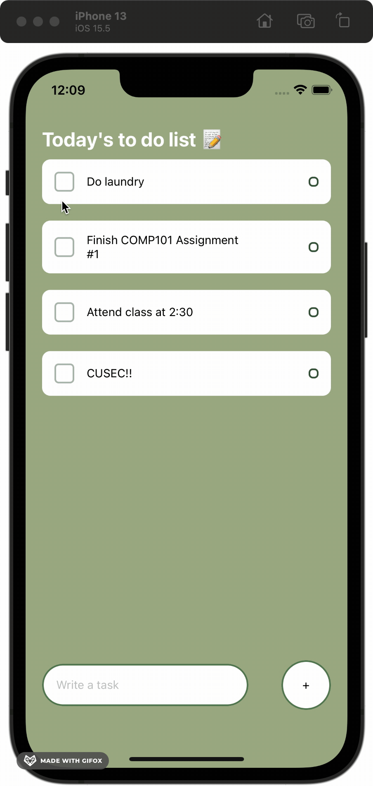
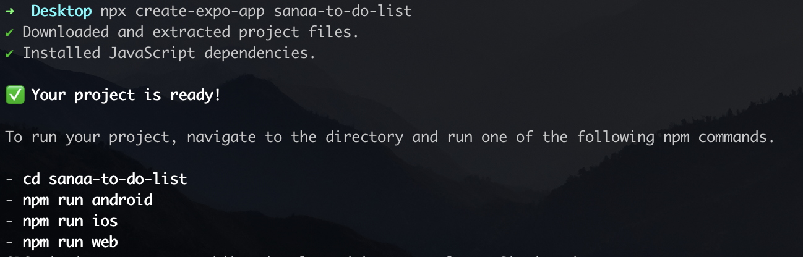
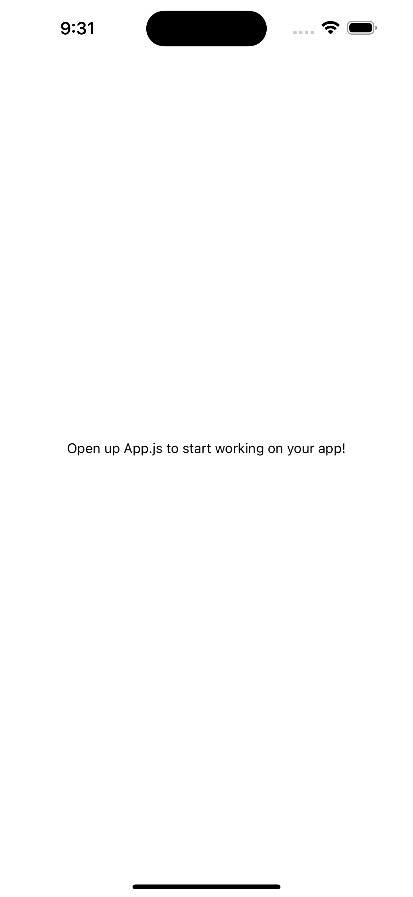

# CUSEC 2023 - Build your first Mobile App
> By Sanaa Syed ([LinkedIn](https://www.linkedin.com/in/sanaasy/))


<p align="center" width="100%">

### FOR THIS WORKSHOP, YOU WILL NEED:
- an IDE (I recommend VS Code)
- [Node.js](https://nodejs.org/en/) installed on your computer
- [Git](https://git-scm.com/)
- A terminal

## 📍 Installing and Setting up Expo 
Follow the steps [here](https://docs.expo.dev/get-started/installation/) to install Expo.
### TL;DR
1. macOS and Linux users need to download [Watchman](https://facebook.github.io/watchman/docs/install#buildinstall)
2. Open your terminal and create an expo account using the command `npx expo register` (if you already have an expo account use `npx expo login`)
3. Download the Expo Go App on your phone
    
You're good to go! 🤩

## 📍 Setting up your expo project
Once you've successfully set up your Expo CLI and have downloaded the Expo Go app, you're ready to create a project! Expo will set you up with all the base code you need to start building your To do list app.

1. Create a project named <your-name>-to-do-list by running the command `npx create-expo-app <your-name>-to-do-list` in your terminal. (Make sure to do this in a location on your computer that you can find easily later on!)
    > You should see something like this when your project has been created:
<p align="center" width="100%"></p> 

2. Navigate to the project directory using `cd <you-name>-to-do-list`.

## 📍 Starting your development server
1. Run `npx expo start` and wait for a QR code to pop up in your terminal.
2. For Android users, press "Scan QR Code" on the "Home" tab of the Expo Go app and scan the QR code you see in the terminal. For Apple users, open the default Apple "Camera" app and scan the QR code you see in the terminal.

Once you see a screen that shows up like this, you're ready to start building! 🥳
<p align="center" width="100%"></p>

> 💻 You can play around with the code in the `App.js` file if you want to get more familiar with how React Native apps are set up. Add some text and see what changes to get familiar with the language.

## 📍 Building the task component
### 💻 Creating the `Task.js` file 
1. Start by creating a folder called `components` (either by right clicking and adding a new folder in VS Code/any editor or through the terminal `mkdir components`). Since React Native is component based, this will make storing all your components/files easier for searchability later on. This is especially useful when you have multiple components but for this project, we'll only be using one.
2. Within the components folder, create another folder called `Task` and within that folder, create a file called `Task.js`.
    
You should have a folder structure that looks like this: 

    ├── components
    │   └── Task
    │       └── Task.js
    
### 💻 Key imports from `react`
Since React Native is built from React, we'll have to import React at the top of any of our `.js` files.
    
At the top of your file, import `React` from the library `react` and the `useState` hook.

```javascript
import React, { useState } from 'react';
```
    
We import `useState` with curly brackets because it is a named module.
    

### 💻 Key imports from `react-native`
Next, import the `View`, `Text` and `StyleSheet` components from `react-native`.

```javascript   
import { View, Text, StyleSheet } from 'react-native';
```
    
The `View` component creates a container. You can use it to encapsulate any component and to create a 'section' of code on the page.
    
### 💻 File template
In React/React Native, the simplest way to define a component is to write a JavaScript function. 

The main Task component will be written in a Javascript anonymous function which will return a React Native element. 

This function will accept a single "props" (short for properties) object argument that will hold data and can be used in this file. This makes the component customized when it is created using different parameters called props. This lets you make a single component that is used in many different places in your app, with slightly different properties in each place. You can use these props by calling `props.<your-prop-name>`.
    
Copy and past this template into your `Task.js` file:

```javascript
import React, { useState } from 'react';
import { View, Text, StyleSheet } from 'react-native';

const Task = (props) => {
    return (
        <View>

        </View>
    )
}

// We need to export the Task component so that we can later use it in the App.js file!
export default Task;
```

A call to the `Task` component would look like 
```javascript
<Task text='Attend workshop at CUSEC!' />
```
    
where the props we pass in is the text. We can then access this prop in our Task function by calling `props.text`.

### 💻 Adding text to the Task
Using the props defined at the beginning of the Task function, we can add text to our task now. We'll be passing in a `text` attribute as the props from the `App.js` file later in this workshop. To call it in this file, it would look like: `props.text`.
    
Use the `View` and `Text` components imported from `react-native` to create a Text View within the already defined `View` component. This will be helpful for styling later on as it creates a container to hold both the checkbox and the text! 

```javascript
return (
    <View>
        <View>
            <Text>{props.text}</Text>
        </View>
    </View>
)
```

### 💻 Building a checkbox 
When you complete a task, you'll want a way to check it off! [We'll be using the `Checkbox` component from the `expo-checkbox` library](https://docs.expo.dev/versions/latest/sdk/checkbox/).
  
1. Install `expo-checkbox` by running `npx expo install expo-checkbox` in your terminal.
2. Add this import to the top of your file: `import Checkbox from 'expo-checkbox';`

<br />

### 🧠🧠🧠
The `useState` hook lets you add React state to function components.
  
```javascript
const Example = (props) => {
    const [count, setCount] = useState(0)
    return <div />;
}
```
    
This code basically says that the variable `count` has a default value of 0 (`count = 0`). The `setCount` is a function that will automatically set the variable `count` to any other **integer** value that we give it at any other point in the code.
> Note: this default value can be any type (string, integer, boolean...).
    
```javascript
const Example = (props) => {
    const [count, setCount] = useState(0)
    
    return (
        <p>{count}</p>
        <button onClick={() => setCount(count + 1)}>
            Click me
        </button>
    );
}
```
    
This would increment the `count` variable by 1 every time the button is clicked.
### 🧠🧠🧠

<br />

Similarly, We'll use the `useState` hook to check if the checkbox is selected or not. 

1. Add 
    
    ```javascript
    const [isSelected, setSelection] = useState(false);
    ```
   right before your return statement in the `Task` function.  
2. Next, using the `Checkbox` component, we can add 
    ```javascript
    <Checkbox value={isSelected} onValueChange={setSelection} color='#3a5a40' />
    ```
   right before the `Text` component.


The `Checkbox` component handles the use of hook for us so we don't have to worry about anything else!
    
Now your `Task` function should look something like this:
```javascript
const Task = (props) => {
    const [isSelected, setSelection] = useState(false);

    return (
    <View>
        <View>
            <Checkbox
            value={isSelected}
            onValueChange={setSelection}
            color='#3a5a40'
            />
            // OPTIONAL: you can add a strikethrough in the text when the checkbox is selected 
            <Text style={{textDecorationLine: isSelected ? "line-through" : "none" }}>{props.text}</Text>
        </View>
    </View>
    )
}
```

### 🖍️ Stylesheet
Now it's time to add some styles to your component using the `StyleSheet` we imported and your CSS skills!

Add a variable called styles above your export like this: 
```javascript
const styles = StyleSheet.create({});
```

An example of the styling I used:
```javascript
const styles = StyleSheet.create({
    task: {
    backgroundColor: '#FFF',
    padding: 15,
    borderRadius: 10,
    flexDirection: 'row',
    alignItems: 'center',
    justifyContent: 'space-between',
    marginBottom: 20,
    },
    taskTextContainer: {
    maxWidth: '80%',
    },
    taskMargin: {
    flexDirection: 'row',
    alignItems: 'center',
    flexWrap: 'wrap',
    },
    checkbox: {
    width: 24,
    height: 24,
    opacity: 0.4,
    borderRadius: 5,
    marginRight: 15,
    },
});
```

You can call these styles in your `Task` function by using the `style` attribute: 
```javascript  
<View style={styles.task} />
```

Play around with the stylings and add them to your code.
  
### ✅ Final Task.js file

<details>
    <summary>Answer</summary>
    
    import React, { useState } from 'react';
    import { View, Text, StyleSheet } from 'react-native';
    import Checkbox from 'expo-checkbox';

    const Task = (props) => {
        const [isSelected, setSelection] = useState(false);

        return (
        <View style={styles.task}>
            <View style={styles.taskMargin}>
                <Checkbox
                value={isSelected}
                onValueChange={setSelection}
                color='#3a5a40'
                style={styles.checkbox}
                />
                <Text style={{ ...styles.taskText, textDecorationLine: isSelected ? "line-through" : "none" }}>{props.text}</Text>
            </View>
        </View>
        )
    }

    const styles = StyleSheet.create({
        task: {
        backgroundColor: '#FFF',
        padding: 15,
        borderRadius: 10,
        flexDirection: 'row',
        alignItems: 'center',
        justifyContent: 'space-between',
        marginBottom: 20,
        },
        taskTextContainer: {
        maxWidth: '80%',
        },
        taskMargin: {
        flexDirection: 'row',
        alignItems: 'center',
        flexWrap: 'wrap',
        },
        checkbox: {
        width: 24,
        height: 24,
        opacity: 0.4,
        borderRadius: 5,
        marginRight: 15,
        },
    });

    export default Task;
</details>


<br />

## 📍 Building the main screen
We'll be using the `App.js` file as our main screen file. On the main screen, we have three components to add:
1. The title
2. The input bar
3. The container that will hold all the tasks as they are inputted

## 💻 Key imports
Similar to `Task.js`, we'll want to import the `useState` hook from `React` and a few components from `react-native`. 
```javascript
import React, { useState } from 'react';
import {  Text, View, TextInput, TouchableOpacity, Keyboard, KeyboardAvoidingView, ScrollView, StyleSheet } from 'react-native';
```

Finally, we'll also want to import the `Task` component we created.

```javascript
import Task from './components/Task/Task'
```

### 💻 Adding a title
Inside the `View` component, replace the default text with the title you want to put for your to do list:

```javascript
<Text>Today's to do list 📝</Text>
```

> At this point, you can also remove the default `StatusBar` in the `View`.

### 💻 Creating the input bar
We'll be using the `useState` hook again here with the `TextInput` component to store the value that you enter for a task. We'll keep the default state as `null`.

Add 
```javascript
const [task, setTask] = useState();
```
above the return statement.

> Note: anytime you create a function or hooks, they must go above your return statement!

The input bar is made up of the `TextInput` and a button which will add the task to list of all the inputted tasks.

Add a `TextInput` with the following props: `placeholder`, `value` and `onChangeText`. 

The `onChangeText` is a callback function that is called when the text input's text changes. We use that text to update the state of the variable `task`. 

It should look something like this:
```javascript
<TextInput placeholder={'Write a task'} value={task} onChangeText={text => setTask(text)} />
```
    
As we've done with the `Task` component, we must wrap this text input in a view! However, this time we'll use a different view component called `KeyboardAvoidingView`. This is so that the text input component's position and height on the screen will be automatically based on the keyboard height to remain visible while the virtual keyboard is displayed.
    
Wrap the `TextInput` with this:
    
```javascript
<KeyboardAvoidingView
    behavior={Platform.OS === "ios" ? "padding" : "height"}
>
    <TextInput placeholder={'Write a task'} value={task} onChangeText={text => setTask(text)} />
</KeyboardAvoidingView>
```

Next, we'll use the `TouchableOpacity` component which has an `onPress` prop. This component is a button but has the additional functionality of dimming the opacity of the button when it is clicked. When the button is pressed/clicked, we can call a function that we will make called `addTask`. The goal of this function is to add the input to a list of tasks. 

```javascript
<TouchableOpacity onPress={() => addTask()}>
    <View>
        <Text>+</Text>
    </View>
</TouchableOpacity>
```

For the `addTask` function, we'll create another `useState` hook to store a list and add the default state as an empty array.

```javascript
const [taskList, setTaskList] = useState([]);
```

The `addTask` function will:
1. Dismiss the keyboard that was opens upon tapping the input bar. (`Keyboard.dismiss()`)
2. Use the `setTaskList` function to add the `task` to the `taskList`.
3. Use the `setTask` function to reset the `task` variable to `null`.

To add to an array, you can 'spread' the current values and append the new task to the end like so `[...currList, newItem]`.

The `addTask` function should look like this:

```javascript
const addTask = () => {
    Keyboard.dismiss();
    setTaskList([...taskList, task])
    setTask(null);
}
```

<details>
    <summary>Input Bar code</summary>

    export default function App() {
        const [task, setTask] = useState();
        const [taskList, setTaskList] = useState([]);

        const addTask = () => {
            Keyboard.dismiss();
            setTaskList([...taskList, task])
            setTask(null);
        }

        return (
            <View style={styles.container}>
                <Text>Today's to do list 📝</Text>

                 <KeyboardAvoidingView
                    behavior={Platform.OS === "ios" ? "padding" : "height"}
                 >
                    <TextInput placeholder={'Write a task'} value={task} onChangeText={text => setTask(text)} />
                    <TouchableOpacity onPress={() => addTask()}>
                        <View>
                            <Text>+</Text>
                        </View>
                    </TouchableOpacity>
                </KeyboardAvoidingView>
            </View>
        );
        }
</details>

### 💻 Putting the tasks on the screen
The last piece of code is to add all the tasks from the task list on the screen.

We'll use the `ScrollView` component to add a scroll in case the to do list gets too big and the `Task` component we created above.

Using the `taskList` and the javascript map function, we can iterate through each item on the list and create a `Task` component for it like this:

```javascript
<View>
    <ScrollView>
        {
            taskList.map((item) => {
                return (
                    <Task text={item} />
                )
            })
        }
    </ScrollView>
</View>
```

### 🖍️ Stylesheet
Now, you can add your styles!

```javascript
const styles = StyleSheet.create({
    container: {
        flex: 1,
        backgroundColor: '#a3b18a',
    },
    tasksWrapper: {
        height: '80%'
    },
    sectionTitle: {
        marginTop: 70,
        paddingHorizontal: 20,
        fontSize: 24,
        fontWeight: 'bold',
        color: 'white'
    },
    items: {
        marginTop: 10,
        marginBottom: 10,
        maxHeight: '87%',
        paddingHorizontal: 20,
    },
    inputTask: {
        position: 'absolute',
        bottom: 60,
        width: '100%',
        flexDirection: 'row',
        justifyContent: 'space-around',
        alignItems: 'center'
    },
    input: {
        paddingVertical: 15,
        paddingHorizontal: 15,
        backgroundColor: '#FFF',
        borderRadius: 60,
        borderColor: '#588157',
        borderWidth: 2,
        width: 250,
    },
    addButton: {
        width: 60,
        height: 60,
        backgroundColor: '#FFF',
        borderRadius: 60,
        justifyContent: 'center',
        alignItems: 'center',
        borderColor: '#588157',
        borderWidth: 2,
    }
});
```
    
### ✅ Final App.js file
<details>
    <summary>Answer</summary>
    
    import React, { useState } from 'react';
    import {  Text, View, TextInput, TouchableOpacity, Keyboard, KeyboardAvoidingView, ScrollView, StyleSheet } from 'react-native';
    import Task from './components/Task/Task'

    export default function App() {
        const [task, setTask] = useState();
        const [taskList, setTaskList] = useState([]);

        const addTask = () => {
            Keyboard.dismiss();
            setTaskList([...taskList, task])
            setTask(null);
        }

        return (
            <View style={styles.container}>
                <Text style={styles.sectionTitle}>Today's to do list 📝</Text>
            
                <View style={styles.tasksWrapper}>
                    <ScrollView
                    style={styles.items}
                    >
                        {
                            taskList.map((item, index) => {
                                return (
                                    <Task text={item} key={index} />
                                )
                            })
                        }
                    </ScrollView>
                </View>

                <KeyboardAvoidingView
                    behavior={Platform.OS === "ios" ? "padding" : "height"}
                    style={styles.inputTask}
                >
                    <TextInput style={styles.input} placeholder={'Write a task'} value={task} onChangeText={text => setTask(text)} />
                    <TouchableOpacity onPress={() => addTask()}>
                    <View style={styles.addButton}>
                        <Text>+</Text>
                    </View>
                    </TouchableOpacity>
                </KeyboardAvoidingView>

            </View>
        );
    }

    const styles = StyleSheet.create({
    container: {
        flex: 1,
        backgroundColor: '#a3b18a',
    },
    tasksWrapper: {
        height: '80%'
    },
    sectionTitle: {
        marginTop: 70,
        paddingHorizontal: 20,
        fontSize: 24,
        fontWeight: 'bold',
        color: 'white'
    },
    items: {
        marginTop: 10,
        marginBottom: 10,
        maxHeight: '87%',
        paddingHorizontal: 20,
    },
    inputTask: {
        position: 'absolute',
        bottom: 60,
        width: '100%',
        flexDirection: 'row',
        justifyContent: 'space-around',
        alignItems: 'center'
    },
    input: {
        paddingVertical: 15,
        paddingHorizontal: 15,
        backgroundColor: '#FFF',
        borderRadius: 60,
        borderColor: '#588157',
        borderWidth: 2,
        width: 250,
    },
    addButton: {
        width: 60,
        height: 60,
        backgroundColor: '#FFF',
        borderRadius: 60,
        justifyContent: 'center',
        alignItems: 'center',
        borderColor: '#588157',
        borderWidth: 2,
    }
    });   
</details>

## Congrats!! You have made your first mobile app using React Native and Expo 🥳

All the code can be found in this repository.

Feel free to reach out to me on [LinkedIn](https://www.linkedin.com/in/sanaasy/)!! 
